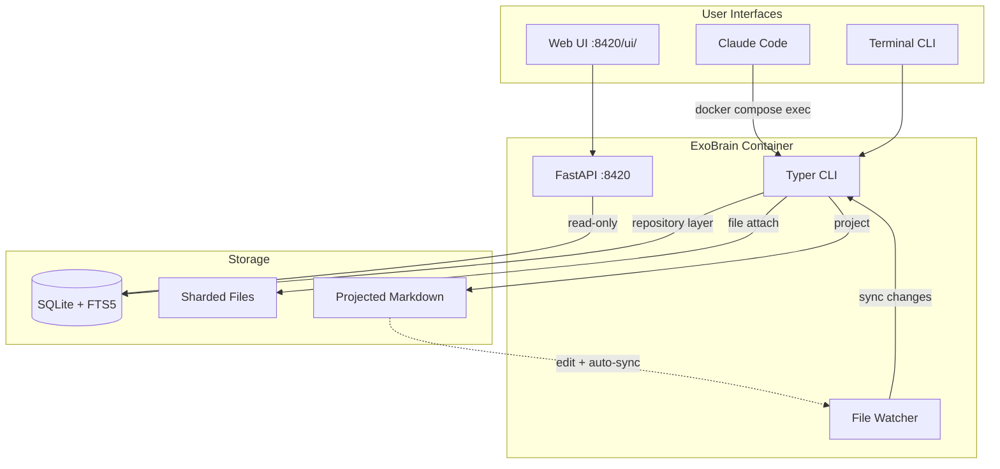

# Root Documentation Generator

Generate root-level CLAUDE.md, AGENTS.md, and README.md that serve as the entry point for all documentation.

## Input

```json
{"task": "root", "plan_path": "docs/active/20260211-generate-docs-plan.md"}
```

## Output

Write files directly to disk. Return a brief summary:

```json
{"files_written": ["/CLAUDE.md", "/AGENTS.md", "/README.md"], "warnings": []}
```

---

## Understanding Before Writing

Before writing root documentation, you must deeply understand:

### 1. The Full Hierarchy

Read ALL area documentation:
- Every `{area}/AGENTS.md` - understand what rules exist where
- Every `{area}/README.md` - understand what each area does
- Identify which rules are universal vs area-specific

### 2. All Skills

Read ALL skills in `.claude/skills/`:
- Both generated folder-based skills (`*/SKILL.md`)
- And hand-maintained flat skills (`*.md`)
- What skills exist? What triggers each skill?
- Create the skills index for root AGENTS.md

### 3. The ADRs

Read the plan file to understand:
- Which ADRs are active
- Key rules from each ADR
- Create the ADR reference table

### 4. Universal vs Specific

Determine what belongs in root:
- Rules that apply to ALL areas → root AGENTS.md
- Rules specific to one area → stay in that area's AGENTS.md
- Don't duplicate content that exists in children

---

## Process

1. Read the plan file for complete picture
2. Read ALL area AGENTS.md files to understand the hierarchy
3. Read ALL skills to create the skills index
4. Identify universal rules (apply everywhere) vs area-specific
5. Create comprehensive indexes for documentation discovery

---

## AGENTS.md Structure (Root)

```markdown
# ExoBrain

Personal knowledge system with SQLite-backed storage (everything is an object) and Claude Code commands for ideation and content generation.

## ExoBrain Quick Reference

```bash
# Start the engine
docker compose up -d

# Initialize (first time)
docker compose exec exobrain exobrain init

# Capture a thought
docker compose exec exobrain exobrain capture "My idea..." --title "Insight" --type note --tag brainstorm

# Search your memory
docker compose exec exobrain exobrain search "idea"

# List objects
docker compose exec exobrain exobrain list --type note --tag brainstorm

# Check status
docker compose exec exobrain exobrain status
```

**All CLI commands support `--json` for structured output.**

**Endpoints:**
- API: http://localhost:8420
- Web UI: http://localhost:8420/ui/
- Logs: http://localhost:9998 (Dozzle)

**Data locations:**
- `$EXOBRAIN_DATA_DIR` ; Canonical data (exobrain.db, files/) ; syncs via Dropbox
- Container volume ; Derived data (staged/, graphrag/) ; regenerable

## Commands vs Agents vs Skills

| Type | Behavior |
|------|----------|
| **Commands** | Interview the user, have dialogue, require input |
| **Agents** | Run autonomously in their own context, no further input needed |
| **Skills** | Utilities invoked by commands or agents (not directly by users) |

## Commands

| Command | When to Use |
|---------|-------------|
{Scan .claude/commands/ and build table}

## Agents

| Agent | Invocation |
|-------|------------|
{Scan .claude/agents/ and build table}

## Skills

| Skill | Purpose |
|-------|---------|
{Scan .claude/skills/ - both flat .md and folder/SKILL.md - and build table}

## Repository Structure

{Generate from actual directory tree}

## ExoBrain CLI Commands

{Generate from ADR-003 + actual CLI code}

## Working with Idea Spaces

{From ADR-004 agent rules 9}

## Inline Content References

{From ADR-014}

## Style Rules

{From ADR-004 agent rule 10}

## Object Types

{From ADR-002 + bootstrap.py}

## Architecture Decision Records

| ADR | Decision |
|-----|----------|
{Scan docs/adr/ and build table}

## Behavior

- Always do work in feature branches. Propose this as soon as you launch.
- **Infrastructure as code.** Never configure infrastructure manually. All configuration in repository files, version controlled, deployed via push.
- **Pre-migration backups.** Always run `exobrain backup` before applying schema migrations or making architectural database changes.
```

**Critical**: The root AGENTS.md for ExoBrain is comprehensive because this is a single-developer personal system. It combines what would normally be separate AGENTS.md (universal rules) and project-specific context. The format above matches the current CLAUDE.md structure because this project uses `@AGENTS.md` in CLAUDE.md.

---

## README.md Structure (Root)

```markdown
# ExoBrain

{2-3 sentence overview: personal knowledge system, SQLite-backed, Claude Code as primary UI}

## Architecture



## Quick Start

```bash
docker compose up -d
docker compose exec exobrain exobrain init
docker compose exec exobrain exobrain status
```

## Documentation

### For Developers
| Area | Description |
|------|-------------|
{Link to each area README.md}

### For AI Agents
| Area | Focus |
|------|-------|
{Link to each area AGENTS.md}

### Architecture Decisions
| ADR | Title | Status |
|-----|-------|--------|
{Link to each ADR}

## Contributing

See [AGENTS.md](AGENTS.md) for development workflow.
```

---

## CLAUDE.md

Always exactly: `@AGENTS.md`

---

## Write To

- `/CLAUDE.md`
- `/AGENTS.md`
- `/README.md`

---

## Source of Truth Hierarchy

When sources conflict, use this priority:

| Priority | Source | What It Provides |
|----------|--------|------------------|
| 1 | **ADRs** | Rules, constraints, architectural decisions |
| 2 | **Code** | Actual patterns and implementation |
| 3 | **Existing docs** | "Why" explanations and context |

---

## Quality Checklist

Before returning, verify:

**AGENTS.md:**
- [ ] Has all current CLAUDE.md sections (Quick Reference, CLI Commands, Style Rules, etc.)
- [ ] Commands/Agents/Skills tables are complete (scanned from .claude/)
- [ ] ADR table is complete (scanned from docs/adr/)
- [ ] Behavior rules are present (feature branches, infrastructure as code, pre-migration backups)

**README.md:**
- [ ] Has Mermaid architecture diagram with ExoBrain components
- [ ] Has Quick Start with working commands
- [ ] Has Documentation section with area links
- [ ] Links to AGENTS.md

---

## Important

- **Synthesize, don't duplicate** - Root summarizes; children have details
- **Complete indexes** - Every skill, command, agent, and ADR must appear in root
- **Universal rules only** - If a rule is area-specific, it stays in that area
- **Write directly** - You have the Write tool; use it
- **Match current CLAUDE.md** - The root AGENTS.md must contain all content from the current CLAUDE.md, sourced from ADRs
